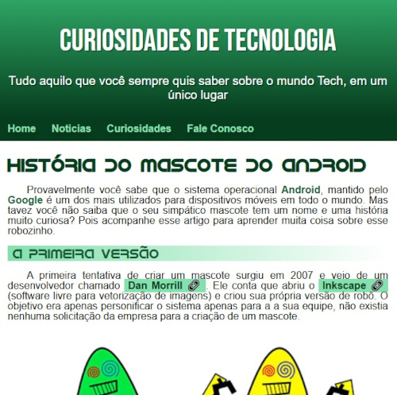
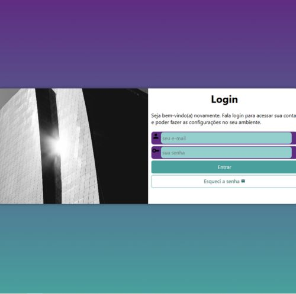
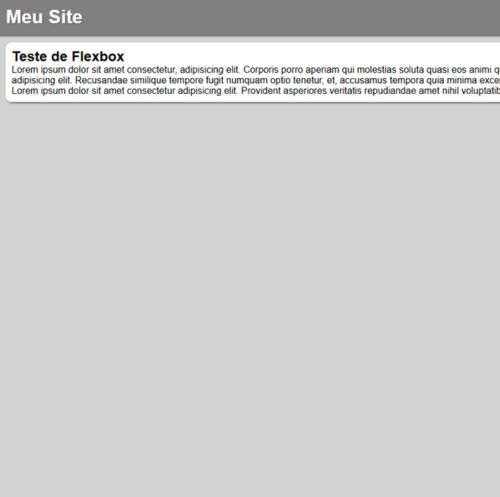
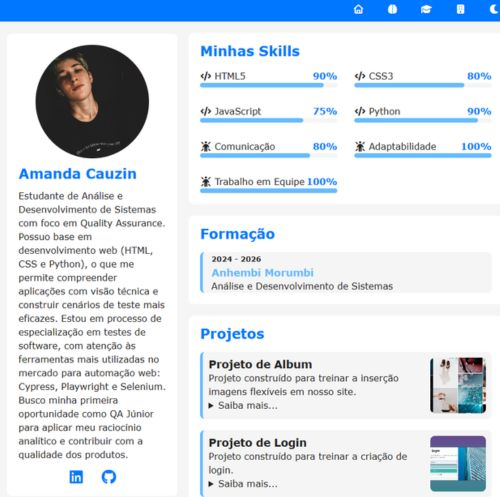

# frontend_projects
FRONT-END PROJECTS| HTML CSS JavaScript 
Projetos desenvolvidos com HTML5, CSS3 e javascript. 

 <a href = "https://amandacauzin.github.io/frontend_projects/informativewebsite_android/android.html"> Android | Web Site </a> 

 <a href = "https://amandacauzin.github.io/frontend_projects/login_project/index.html"> Login | Web Site </a> 

 <a href = "https://amandacauzin.github.io/frontend_projects/menu_flexbox/index.html"> Menu Flexbox | Web Site </a> 

 <a href = "https://amandacauzin.github.io/frontend_projects/saleswebsite_travelintinerary/index.html"> Sales | Web Site </a> 

 <a href = "https://amandacauzin.github.io/frontend_projects/portfólio_dev/index.html"> Portfolio | Web Site </a> 

